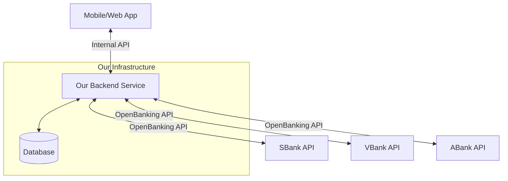

# Backend Logic Design & Architecture

## 1. Architecture Overview

**Stack**: FastAPI (Python) Monolith.
**Database**: SQLite (for hackathon simplicity) or PostgreSQL.
**Integration**: OpenBanking Russia v2.1 API.

The backend is divided into modular services that handle specific domains. The core orchestration happens in `SyncService` (data ingestion) and `AnalyticsService` (data processing).

## 2. Architecture & Data Flow

To clarify the distinction between our Backend API and the External Bank APIs:

*   **Internal API**: The API we build for our frontend application (Client).
*   **External API**: The OpenBanking APIs provided by banks (SBank, VBank, etc.) that our backend calls to fetch data.

## 3. Database Schema

### Users & Auth
- **users**
    - `id` (UUID, PK)
    - `username` (String, unique) - e.g., `team260-123`
    - `created_at` (DateTime)
    - `profile_mode` (Enum: 'debt', 'savings')
    - `subscription_plan` (Enum: 'free', 'premium')

### Banking Integration
- **bank_connections**
    - `user_id` (FK)
    - `bank_id` (String) - e.g., '000000001' (SBank)
    - `status` (Enum: 'active', 'error', 'pending')
    - `last_sync_at` (DateTime)

- **consents**
    - `id` (UUID, PK)
    - `user_id` (FK)
    - `bank_id` (String)
    - `consent_id` (String) - External ID from bank
    - `type` (Enum: 'accounts', 'products')
    - `status` (String)
    - `permissions` (JSON)
    - `expiry_date` (DateTime)

### Financial Data
- **accounts**
    - `id` (String, PK) - External Account ID (e.g., `acc-3691`)
    - `user_id` (FK)
    - `bank_id` (String)
    - `currency` (String)
    - `type` (Enum: 'Personal', 'Business')
    - `sub_type` (Enum: 'Checking', 'Savings')
    - `account_number` (String) - From `identification`
    - `nickname` (String)
    - `balance` (Decimal) - From `InterimAvailable`
    - `booked_balance` (Decimal) - From `InterimBooked`
    - `status` (String)
    - `opening_date` (Date)

- **transactions**
    - `id` (String, PK) - External Transaction ID (e.g., `tx-vbank-00664812`)
    - `account_id` (FK)
    - `amount` (Decimal)
    - `currency` (String)
    - `date` (DateTime) - `bookingDateTime`
    - `value_date` (DateTime) - `valueDateTime`
    - `description` (String) - `transactionInformation`
    - `direction` (Enum: 'Credit', 'Debit') - `creditDebitIndicator`
    - `status` (String)
    - `mcc` (String, optional) - From `merchant.mccCode`
    - `merchant_name` (String) - From `merchant.name`
    - `merchant_category` (String) - From `merchant.category`
    - `merchant_city` (String)
    - `card_number_masked` (String) - From `card.cardNumber`

- **products** (Loans & Deposits)
    - `id` (String, PK) - External Agreement ID (e.g., `loan-team260-3-0447`)
    - `user_id` (FK)
    - `bank_id` (String)
    - `product_code` (String) - `product_id` (e.g., `prod-81008287967b`)
    - `type` (Enum: 'loan', 'deposit') - `product_type`
    - `name` (String) - `product_name`
    - `amount` (Decimal) - Principal or Deposit amount
    - `currency` (String) - Default RUB
    - `interest_rate` (Decimal)
    - `start_date` (DateTime)
    - `end_date` (DateTime, nullable)
    - `linked_account_number` (String)
    - `status` (String)

### Analytics & State
- **analytics_snapshots**
    - `user_id` (FK)
    - `calculated_at` (DateTime)
    - `sts_today` (Decimal)
    - `mdp_today` (Decimal)
    - `adp_today` (Decimal)
    - `total_debt` (Decimal)
    - `health_score` (Integer)
    - `forecast_data` (JSON) - Cached STS curve

## 4. Internal API Specification (Frontend -> Backend)

This section describes the API endpoints that **our frontend** calls to communicate with **our backend**.

### Auth & Onboarding
- `POST /api/auth/login`: Login/Register by username. Returns JWT.
- `GET /api/banks`: List supported banks.
- `POST /api/onboarding/consents`: Create consents for selected banks.
- `GET /api/onboarding/status`: Check sync status.
- `POST /api/onboarding/goal`: Set user goal ('debt' or 'savings').

### Dashboard (Home)
- `GET /api/dashboard`: Aggregated view.
    - Returns: `sts_today`, `mdp_today`, `adp_today`, `total_balance`, `next_events`, `alerts`.
    - Logic: Calls `AnalyticsService` to get cached or fresh metrics.

### Loans & Deposits
- `GET /api/loans`: List of loans with calculated priority.
    - Returns: List of loans sorted by `loan_ranking_engine`.
- `GET /api/deposits`: List of deposits.
- `POST /api/payments/plan`: Execute a planned payment (MDP/ADP/SDP).
    - Payload: `{ type: 'MDP'|'ADP', amount: 1000, source_account_id: '...' }`
    - Logic: Records the "payment" (simulation) and updates local state/cache.

### Refinance
- `GET /api/refinance/offers`: Get personalized offers.
    - Logic: Runs `best_financing_offer_selector`.
- `POST /api/refinance/apply`: Apply for an offer.

### Profile
- `GET /api/profile`: User details, subscription status.
- `POST /api/profile/subscription`: Upgrade to Premium.

## 5. External API Integration (Backend -> Banks)

This section describes how **our backend** calls **External Banks** (OpenBanking API).

-   **Auth**: We use the `client_id` and `client_secret` (e.g., `team260-3`) to get an access token from the bank.
-   **Consents**: We request permission to read data (`POST /account-consents`).
-   **Data Fetching**:
    -   `GET /accounts`: Get list of accounts.
    -   `GET /accounts/{id}/balances`: Get balance.
    -   `GET /accounts/{id}/transactions`: Get history.
    -   `GET /products`: Get loans and deposits.

## 6. Core Logic & Algorithms Implementation

### A. Data Ingestion (SyncService)
1.  **Trigger**: Onboarding or periodic background task.
2.  **Process**:
    -   Iterate over `active` consents.
    -   Fetch `accounts`, `balances`, `transactions` (last 90 days), `products`.
    -   Normalize and save to DB.
    -   **Crucial**: Trigger `AnalyticsService.recalculate(user_id)` after sync.

### B. Transaction Categorization (`transactions_categorization_salary_and_loans`)
-   **Input**: Raw transactions.
-   **Logic**:
    -   **Salary**: Detect incoming txs with regularity ~30 days, specific keywords ('salary', 'zp'), or high amount relative to others.
    -   **Loan Repayment**: Detect outgoing txs to known bank MCCs or keywords ('loan', 'credit'), matching `products` payment amounts.
-   **Output**: Tag transactions in DB. Update `user_profile` with `income_day`, `income_amount`.

### C. STS Calculation (`sts_calculation`)
-   **Formula**: `Safe-to-Spend = (Current Liquidity + Projected Income - Projected Mandatory Payments) / Days to Next Income`
-   **Implementation**:
    1.  Get `total_debit_balance` (sum of checking/savings accounts).
    2.  Get `projected_income` (salary expected before next period).
    3.  Get `mandatory_payments` (MDP + Rent + Subscriptions) due before next income.
    4.  Calculate `free_cash`.
    5.  Divide by days remaining.
    6.  Apply `safety_buffer` (e.g., 10%).

### D. Debt Manager (`mdp_calculation`, `adp_calculation`)
-   **MDP (Mandatory Daily Payment)**:
    -   Sum of all monthly loan payments.
    -   Divide by 30 (daily accrual view) OR simply track "Amount due today" based on due dates.
    -   *Refinement*: The doc suggests a "Daily" view. `MDP = (Payment - Paid) / Days_Left`.
-   **ADP (Additional Daily Payment)**:
    -   Based on strategy (Snowball/Avalanche).
    -   `ADP = (Free Cash - STS) * Aggressiveness_Factor`.
    -   Allocated to the highest priority loan (highest rate for Avalanche, lowest balance for Snowball).

### E. Refinance Logic (`financing_need_detector`, `best_financing_offer_selector`)
-   **Detector**:
    -   Check DTI (Debt-to-Income). If > 50%, flag "High Load".
    -   Check if `weighted_average_rate` > `market_rate - 2%`.
-   **Selector**:
    -   Fetch offers from `RefinanceProvider` (mock or API).
    -   Calculate `Net Benefit = (Old_Payment * Months) - (New_Payment * Months) - Fees`.
    -   Sort by Benefit.

## 7. Integration Strategy

-   **Mocking**: Since we might not have real bank connections for all judges, implement a `MockBankClient` that returns realistic static data (from `team260_data` or generated).
-   **OpenBanking**: Use the provided `curl` scripts (`curl_fixed.sh`, `curl_requests_team260-3.sh`) logic to implement `RealBankClient` using `httpx`. These scripts contain the exact headers and endpoints required.
-   **Switching**: Config flag `USE_MOCK_BANKS=True/False`.
